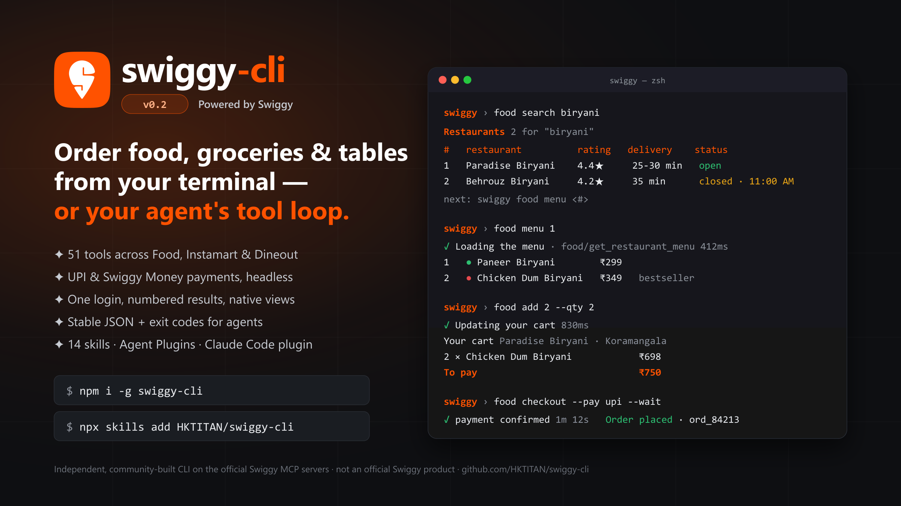

<div align="center">


# swiggy-cli

**A full-screen terminal app and a scriptable CLI for the official [Swiggy MCP](https://mcp.swiggy.com/builders/) servers: Food, Instamart, Dineout.**

**Powered by Swiggy.**

[](https://www.npmjs.com/package/swiggy-cli)
[](https://www.npmjs.com/package/swiggy-cli)
[](https://github.com/HKTITAN/swiggy-cli/actions/workflows/ci.yml)
[](https://nodejs.org)
[](./LICENSE)

[](https://skills.sh/HKTITAN/swiggy-cli)
[](https://agent-plugins.org)

</div>

```bash
npm install -g swiggy-cli
swiggy            # full-screen app: search, arrow keys, Enter, cart, checkout — one screen
```

<a href="https://github.com/HKTITAN/swiggy-cli"></a>

`swiggy-cli` talks to the three Model Context Protocol servers Swiggy runs at `mcp.swiggy.com` (`/food`, `/im`, `/dineout`). Humans get a full-screen app where every result is a row you can select. Agents get one stable JSON envelope per command, deterministic exit codes, gated destructive tools and a generic `call` that reaches every tool the servers expose (51 today, and whatever ships next).

> **Powered by [Swiggy MCP](https://mcp.swiggy.com/builders/).** This is an **independent, community-built CLI**, not an official Swiggy product. The Swiggy name and mark are trademarks of Swiggy Limited, shown unmodified per Swiggy's [brand guidelines](https://mcp.swiggy.com/builders/docs/operate/support/#co-branding) to identify the service this tool integrates with. Listings, prices and availability come from Swiggy and are shown as received.

**Links** · [Builder docs](https://mcp.swiggy.com/builders/docs/) · [Tool reference](https://mcp.swiggy.com/builders/docs/reference/) · [Skills on skills.sh](https://skills.sh/HKTITAN/swiggy-cli) · [Wiki](./wiki) · [AGENTS.md](./AGENTS.md) · [Changelog](./CHANGELOG.md)

---

## Contents

- [The app](#the-app)
- [Quick start](#quick-start)
- [For AI agents](#for-ai-agents)
- [Human mode and agent mode](#human-mode-and-agent-mode)
- [Payments](#payments)
- [Auth and config](#auth-and-config)
- [Commands](#commands)
- [Architecture](#architecture)
- [Safety](#safety)
- [What's new](#whats-new)
- [Contributing, troubleshooting, license](#contributing)

---

## The app

`swiggy` with no arguments opens a full-screen session (also `swiggy app`). It owns the terminal the way an editor does: your scrollback survives, frames never tear, and one process keeps one warm MCP session for every command you run.

```text
 swiggy v0.2.3  ● signed in  · address addr_2…                        Powered by Swiggy  ? help  q quit
 swiggy › food search biryani
 Restaurants 2 of 2 for "biryani"
 ┌───┬──────────────────┬─────────────────────┬─────────────┬──────────────┬─────────────────────┬────────┐
 │ # │ restaurant       │ cuisines            │ rating      │ for two      │ delivery            │ status │
 ├───┼──────────────────┼─────────────────────┼─────────────┼──────────────┼─────────────────────┼────────┤
 │ 1 │ Paradise Biryani │ Biryani, Hyderabadi │ 4.4★ (10K+) │ ₹400 for two │ 25-30 mins · 1.2 km │ open   │
 │ 2 │ Behrouz Biryani  │ Biryani, Mughlai    │ 4.2★        │ ₹500 for two │ 35 min              │ closed │
 └───┴──────────────────┴─────────────────────┴─────────────┴──────────────┴─────────────────────┴────────┘
 Searching restaurants 412ms   2 rows · Enter: open menu · #2 Behrouz Biryani
 swiggy › ▌
 ↑↓ select · Enter open/run · type a command · Tab complete · PgUp/PgDn scroll · c cart · o orders · q quit
```

| Key | Does |
| --- | --- |
| type + Enter | run any swiggy command (`food search biryani`, `instamart search milk`, `dineout search italian --address-id 1`) |
| ↑ ↓ | move the selection over the numbered rows of the last listing |
| Enter on a row | restaurant → menu · dish/product → add 1 to cart · Dineout restaurant → slots · slot → prepare the booking · order → details · address → make it the default |
| Tab | complete commands (shared prefix first, then the candidates) |
| c · o · a | cart · orders · addresses for the current service |
| PgUp/PgDn, Home/End | scroll the output pane |
| y / n | answer a confirmation (orders, bookings, cart clearing, address deletion ask inline) |
| ? · Esc · q | help · clear the line · quit (Ctrl+C always quits) |

The app answers its own prompts. If you have no default address it asks once, then carries the choice through the session. `swiggy shell` is the same session as a plain line-oriented REPL for terminals that cannot run the app.

---

## Quick start

```bash
npm install -g swiggy-cli

swiggy auth init                                  # browser: phone + OTP. One login for Food, Instamart, Dineout
swiggy                                            # the app; or the commands below
```

```bash
swiggy food search biryani                        # numbered results…
swiggy food menu 1                                # …so the next command takes the number
swiggy food add 3 --qty 2                         # menu_item_id + restaurant filled in for you
swiggy food cart
swiggy food checkout --pay upi --wait             # scan-or-tap link → polls → confirms

swiggy instamart search milk
swiggy instamart add 1 --qty 2                    # merges into your current cart
swiggy instamart checkout --pay cash

swiggy dineout search italian --address-id 1      # 1 = first saved location
swiggy dineout slots 1 --date 2026-09-06
swiggy dineout book 2 --guests 2                  # free deal books directly; paid: add --pay upi --wait
```

Raw ids work everywhere a row number does. Set an address once with `swiggy profile set default defaultAddressId <id>`; otherwise the CLI asks, and remembers the answer for the following commands.

Agents and scripts add `--json --no-interactive`:

```bash
swiggy food search -q sushi --json --no-interactive | jq '.data.restaurants[0]'
```

<details>
<summary><b>Install options</b></summary>

`swiggy-cli` requires **Node.js 20+**.

```bash
npm install -g swiggy-cli        # global (recommended)
pnpm add -g swiggy-cli
yarn global add swiggy-cli
npx -p swiggy-cli swiggy <args>  # zero-install
```

A mirror is published to GitHub Packages as `@hktitan/swiggy-cli` (`--registry https://npm.pkg.github.com`, needs a GitHub token with `read:packages`); npmjs.com is canonical.

The npm package is `swiggy-cli`; it installs two binaries: `swiggy` (canonical) and `smn` (short alias).

</details>

---

## For AI agents

### Skills (skills.sh / Agent Skills spec)

Fourteen focused skills live under [`skills/`](./skills) and on [skills.sh/HKTITAN/swiggy-cli](https://skills.sh/HKTITAN/swiggy-cli). Each is one `SKILL.md`, written to be strict and to explain *why*, so an agent walks the same decision tree every time.

```bash
npx skills add HKTITAN/swiggy-cli            # pick skills + agents interactively
npx skills add HKTITAN/swiggy-cli --all      # everything, every agent
npx skills add HKTITAN/swiggy-cli -s swiggy-mcp -s swiggy-mcp-payments -a claude-code
```

| Skill | Teaches an agent to… |
| --- | --- |
| `swiggy-cli` | drive this CLI: machine mode, envelope, exit codes, auth detection, why never to run bare `swiggy` |
| `swiggy-search` · `swiggy-cart` · `swiggy-checkout` · `swiggy-pay` · `swiggy-dineout-booking` · `swiggy-track` · `swiggy-address` | one task each, via the CLI |
| `swiggy-mcp` | use the **official MCP servers directly**: auth, envelope, errors, rate limits, safety rules (+ a 51-tool parameter reference) |
| `swiggy-mcp-food` · `swiggy-mcp-instamart` · `swiggy-mcp-dineout` | the end-to-end journey on each server with exact parameters |
| `swiggy-mcp-payments` | the UPI / Cash / Swiggy Money flow, widget and headless, per-server confirm contract |
| `swiggy-mcp-docs` | look up Swiggy's docs (`llms.txt`, per-page `.md`) before writing Swiggy code |

### Plugins

- **Agent Plugins 1.0.0** ([agent-plugins.org](https://agent-plugins.org)): the repo root is a valid plugin — [`plugin.json`](./plugin.json), [`mcp.json`](./mcp.json) (the three Streamable HTTP servers), `skills/`.
- **Claude Code**: `claude plugin marketplace add HKTITAN/swiggy-cli` then `claude plugin install swiggy@swiggy-cli` — installs the skills and pre-wires the three MCP servers ([`.claude-plugin/`](./.claude-plugin), [`.mcp.json`](./.mcp.json)).
- Any other client: `swiggy mcp-config --client cursor|vscode|windsurf|claude|codex|plugin` prints the config to paste.

### Docs on demand

```bash
swiggy docs                                   # llms.txt index
swiggy docs reference/instamart/update_cart   # one page as Markdown
swiggy docs --full                            # everything (~400 KB)
```

See [AGENTS.md](./AGENTS.md) for the full agent contract.

---

## Human mode and agent mode

Every command builds a structured envelope first; renderers turn it into a view or a JSON line, so the two modes cannot disagree.

**Human mode** (default in a terminal): a native view per response (restaurants, menus, carts with the bill, products with pack sizes, orders, tracking, slots, bookings, payment methods), Swiggy's own `message` rendered as Markdown, a status line with elapsed time, clickable links, an address picker, and confirmation prompts for destructive actions.

**Agent mode** flags:

| Flag | Behaviour |
| --- | --- |
| `--json` | one JSON envelope on stdout; no prose, colour or spinner |
| `--plain` | TSV: header row + rows (same column choice as the table) |
| `--raw` | the untouched MCP `tools/call` result |
| `--quiet` | no non-essential stderr |
| `--no-interactive` | never prompt; fail closed (also implied when stdout is not a TTY) |
| `-y, --yes` | consent for destructive tools |

Envelope:

```json
{ "ok": true, "server": "food", "tool": "search_restaurants",
  "data": { "restaurants": [ … ], "nextOffset": 10 },
  "meta": { "profile": "default", "message": "…", "rateLimit": { "limit": 70, "remaining": 61, "reset": 1720000060 } } }
```

`data` is the tool's own payload. Swiggy's `{ success, data, message }` wrapper is unwrapped, `message` goes to `meta.message`, and a `success: false` becomes an error envelope:

```json
{ "ok": false, "error": { "code": "MCP_ERROR", "message": "Invalid addressId: required", "hint": "Run: swiggy food addresses, then retry with --address-id <id>" } }
```

### Exit codes

| Code | Meaning |
| ---: | --- |
| 0 | success |
| 1 | unknown failure |
| 2 | usage error |
| 3 | auth required / failed → `swiggy auth init` |
| 4 | not found (tool / docs page) |
| 5 | network failure |
| 6 | Swiggy tool error (`success:false`, `isError`, JSON-RPC error) |
| 7 | confirmation required (destructive tool without `--yes` in machine mode) |
| 8 | config error |
| 9 | rate limited (HTTP 429; `error.details.retryAfterSeconds`) |
| 10 | payment failed / cancelled / timed out during `--wait` |

---

## Payments

```text
get_payment_options → place order (Cash | UPI app | UPI QR | SwiggyPay) → PENDING_PAYMENT
     → check_payment_status (Swiggy's cadence) → confirm_order → PLACED → track
```

```bash
swiggy instamart payment-options                       # what this cart can pay with
swiggy instamart checkout --pay cash                   # COD: placed immediately
swiggy instamart checkout --pay upi --wait             # link → poll → confirm, one command
swiggy instamart checkout --pay upi                    # two-step: returns paasId/orderId/bridgeUrl + meta.payment.next
swiggy instamart payment-status --paas-id <p> --order-id <o> --wait
swiggy food checkout --pay upi:gpay://upi/ --wait      # a specific UPI app from payment-options
swiggy food checkout --pay swiggypay                   # Swiggy Money, when the server offers it
```

The CLI honours `pollingIntervalInMs` / `maxTimeToPollForInMs` from Swiggy, never tight-loops the long-poll, applies the right `confirm_order` contract per server (Food: `orderId + addressId + lat + lng`; Instamart/Dineout: `orderId + paasId`), and never announces success on a pending order. Details: [`wiki/payments.md`](./wiki/payments.md).

---

## Auth and config

```text
~/.swiggy/                      (override with SWIGGY_HOME)
├── config.json                 profiles, defaults, endpoint overrides
├── auth.json                   OAuth token (mode 0600)
├── history                     app / shell command history
└── cache/
    ├── sessions.json           Mcp-Session-Id per server (reused across invocations)
    └── recent.json             numbered rows of the last listings + carried context
```

```bash
swiggy auth init                 # browser OAuth 2.1 + PKCE; dynamic client registration; one token for all servers
swiggy auth init --no-browser    # print the URL instead (SSH sessions)
swiggy auth status               # per-server token state + expiry (tokens last 5 days; re-run init when expired)
swiggy auth logout
swiggy doctor                    # runtime, config, auth, OAuth metadata, live tool list, catalog drift, docs reachability
```

Profiles hold defaults so commands stay short: `defaultAddressId` (Food/Instamart), `defaultLat` / `defaultLng` (Dineout), `output`, and per-server `endpoints` overrides (or `SWIGGY_FOOD_URL` / `SWIGGY_INSTAMART_URL` / `SWIGGY_DINEOUT_URL`).

---

## Commands

`swiggy --help` is complete; the short version:

| Area | Commands |
| --- | --- |
| Sessions | `app` (default with no arguments) · `shell` |
| Generic | `servers` · `tools <server> [--offline]` · `schema <server> <tool>` · `call <server> <tool> --input <json>` · `docs [path]` · `mcp-config` · `doctor` |
| Food | `search` · `search-menu` · `menu` · `addresses` · `create-address` · `delete-address` · `cart` · `add` · `clear-cart` · `list-coupons` · `apply-coupon` · `checkout` · `orders` · `order` · `track` · `delivery-status` · `payment-options` · `payment-status` · `confirm-order` · `report-error` |
| Instamart (`im`) | `search` · `go-to-items` · `addresses` · `create-address` · `delete-address` · `cart` · `add` · `set-cart` · `clear-cart` · `list-coupons` · `apply-coupon` · `checkout` · `orders` · `order` · `track` · `delivery-status` · payment/support as above |
| Dineout | `search` · `details` · `locations` · `slots` · `cart` · `book` · `status` · `cancel` · payment/support as above |
| Auth/config | `auth init\|status\|whoami\|logout` · `config show\|path\|init` · `profile list\|use\|create\|delete\|set` |

Full mapping with flags: [`wiki/commands.md`](./wiki/commands.md). Upstream catalog with parameters: [`wiki/tools-catalog.md`](./wiki/tools-catalog.md).

---

## Architecture

```text
swiggy (no args) ──► src/tui/app.ts   full-screen session: keypresses, output pane, prompts, status sink
swiggy <verb>    ──► Layer A (ergonomic, documented params) ──► Layer B  swiggy call <server> <tool>
                                                                    └── McpClient · Streamable HTTP · JSON or SSE
                                                                        ├── persisted Mcp-Session-Id, 404 → re-init once
                                                                        ├── 401/419 → AUTH, 429 → RATE_LIMITED, -32001 → AUTH
                                                                        └── https://mcp.swiggy.com/{food,im,dineout}
```

- `src/commands/*` — verbs; `payments.ts` and `address.ts` are shared across servers; `shell.ts` runs a command line in-process.
- `src/tui/app.ts` — the full-screen app. Commands run in-process with their output captured into the pane; prompts and progress go through two small interfaces (`lib/prompter.ts`, the status sink in `lib/ui.ts`) that the app implements.
- `src/lib/mcp.ts` — client; `auth.ts` — OAuth (RFC 9728/8414 discovery, DCR, PKCE); `payments.ts` — pure payment-flow logic; `aliases.ts` — the verified 51-tool catalog; `recent.ts` — numbered rows and carried context.
- `src/lib/term.ts` + `ui.ts` — terminal capability detection and the status line (techniques borrowed from Grok Build's TUI).
- Tests: unit (`aliases`, `payments`, `envelope`), the client against a mock MCP server, black-box tests of the built binary, and the app and shell driven end to end through fake terminals. `npm test` builds first.

More: [`wiki/architecture.md`](./wiki/architecture.md).

---

## Safety

- Destructive tools — `place_food_order`, `checkout`, `book_table`, `cancel_booking`, `flush_food_cart`, `clear_cart`, `delete_address` — ask for confirmation, or need `--yes` in machine mode.
- Order placement is never retried automatically; check `orders` / `status` first (Swiggy's own guidance).
- Food/Instamart orders cannot be cancelled via the API. Swiggy customer care: 080-67466729.
- Tokens live at `~/.swiggy/auth.json` (mode 0600). Nothing secret is printed in human or JSON mode; `--raw` echoes the literal MCP response by design. No telemetry; the CLI talks only to `mcp.swiggy.com`.

---

## What's new

### 0.2.2 / 0.2.1 (September 2026)

- **0.2.2:** a line typed while a command is still running is queued and runs next instead of being dropped.

- **The full-screen app** (`swiggy`, `swiggy app`): arrow keys over results, Enter to drill in, inline confirmations, live output, tab completion, history.
- **Sessions no longer end after the first command.** The address picker used a library that closed stdin behind the session's back; prompts are now answered by the session itself.
- **One banner, not one per command** inside a session.
- **Address carry-over.** Pick an address once; later commands reuse it until you set a default or pass `--address-id`.
- **Numbered rows are written before the next command runs**, so `food menu 1` right after a search works inside a session too.

### 0.2.0 (September 2026)

Swiggy's MCP surface grew from 35 to **51 tools**; 0.2.0 caught up with all of it: documented camelCase parameters everywhere, the shared Payment stage (`--pay cash|upi|upi:<app>|swiggypay [--wait]`), new verbs for every new tool, one login for all servers, rate-limit awareness with persisted sessions, native views with numbered references, 14 skills, plugin manifests, `swiggy docs`, `swiggy mcp-config`, and the [`llm-wiki/`](./llm-wiki) research wiki. Full list: [CHANGELOG.md](./CHANGELOG.md).

---

## Contributing

```bash
npm ci && npm run lint && npm test && npm run validate:skills
```

See [CONTRIBUTING.md](./CONTRIBUTING.md) and [`wiki/releasing.md`](./wiki/releasing.md).

## Troubleshooting

`swiggy doctor` first. Common cases in [`wiki/troubleshooting.md`](./wiki/troubleshooting.md): `AUTH_REQUIRED` after 5 days (re-run `auth init`), `Missing address id` in machine mode (pass `--address-id` or set `defaultAddressId`), Dineout "missing coordinates" (search with `--address-id` first), `npx swiggy` not found (`npx -p swiggy-cli swiggy`), the app in a terminal without raw-mode support (use `swiggy shell`).

## License

[MIT](./LICENSE) for this CLI's code. Powered by Swiggy: the upstream MCP servers, listings and content are operated and owned by Swiggy Limited under their own terms; see <https://mcp.swiggy.com/builders/docs/>. This is an independent, community-built tool, not an official Swiggy product.
